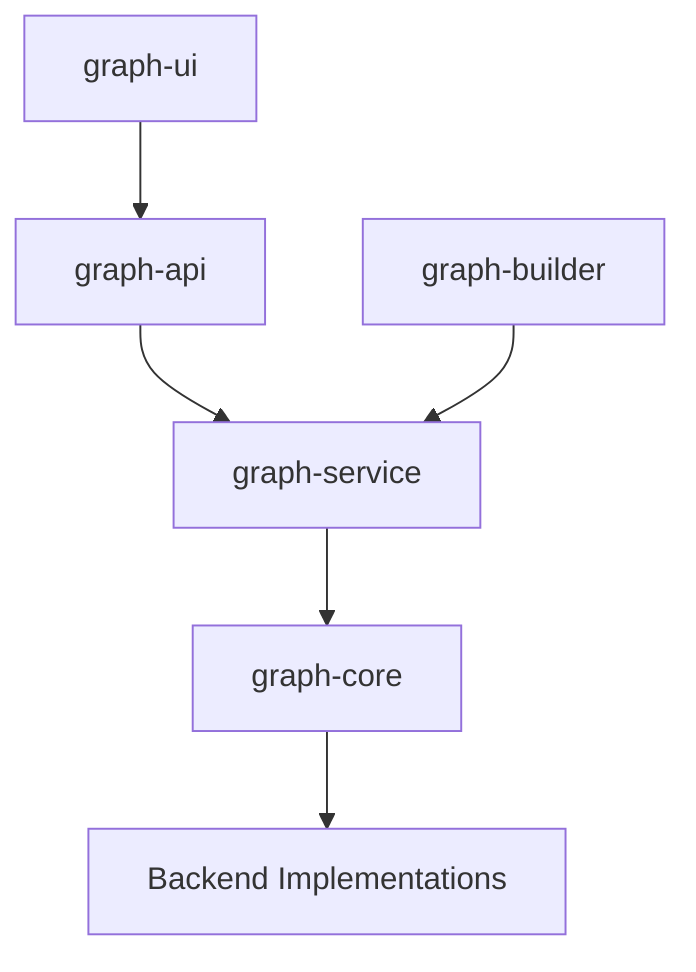

# 🧩 Knowledge Graph Assisted Research IDE Components and Dependencies

## 📚 Table of Contents
1. [Core Components](#-core-components)
2. [Service Layer Components](#-service-layer-components)
3. [API Layer Components](#-api-layer-components)
4. [Storage Components](#-storage-components)
5. [UI Components](#-ui-components)
6. [LLM Integration Components](#-llm-integration-components)
7. [Project Structure](#-project-structure)
8. [Dependency Management Strategy](#-dependency-management-strategy)
   - [Multiple pyproject.toml Approach](#multiple-pyprojecttoml-approach-recommended)
   - [Root pyproject.toml Purpose](#root-pyprojecttoml-purpose)
   - [Alternative: Single pyproject.toml](#alternative-single-pyprojecttoml)
   - [Rationale for Multiple pyproject.toml Decision](#rationale-for-multiple-pyprojecttoml-decision)
   - [Inter-Package Dependency Management](#inter-package-dependency-management)
   - [Development Workflow Examples](#development-workflow-examples)
   - [CI/CD Workflow Examples](#cicd-workflow-examples)
   - [Helper Scripts](#helper-scripts)
   - [Best Practices](#best-practices)
9. [Implementation Dependencies](#-implementation-dependencies)
10. [Development Phases](#-development-phases)
11. [Implementation Notes](#-implementation-notes)

## 🎯 Core Components

### 1. GraphContext
- **Purpose**: Core abstraction for graph operations
- **Dependencies**: None (base component)
- **Key Features**:
  - Entity/relation CRUD
  - Type validation
  - Query execution
  - Backend routing
- **Implementation Priority**: High (Required for all other components)
- **Estimated Effort**: 3-4 weeks

### 2. Backend Connectors
- **Purpose**: Database-specific implementations
- **Dependencies**: GraphContext interface
- **Implementations**:
  ```python
  class Neo4jConnector(AbstractGraphBackend):
      # Neo4j-specific implementation

  class ArangoConnector(AbstractGraphBackend):
      # ArangoDB-specific implementation

  class FileDBConnector(AbstractGraphBackend):
      # File-based implementation for testing/development
  ```
- **Implementation Priority**: High (Start with one backend)
- **Estimated Effort**: 2-3 weeks per backend

### 3. Type System
- **Purpose**: Schema and type management
- **Dependencies**: GraphContext
- **Key Features**:
  - Type definitions
  - Property validation
  - Reference checking
- **Implementation Priority**: High
- **Estimated Effort**: 2 weeks

## 🔧 Service Layer Components

### 1. GraphManager
- **Purpose**: High-level graph operations
- **Dependencies**:
  - GraphContext
  - Type System
- **Key Features**:
  - Multi-step operations
  - Transaction management
  - Error handling
- **Implementation Priority**: High
- **Estimated Effort**: 2-3 weeks

### 2. EntityService
- **Purpose**: Entity-specific operations
- **Dependencies**: GraphManager
- **Key Features**:
  - Entity creation/update workflows
  - Property management
  - Validation logic
- **Implementation Priority**: Medium
- **Estimated Effort**: 1-2 weeks

### 3. RelationService
- **Purpose**: Relationship management
- **Dependencies**:
  - GraphManager
  - EntityService
- **Key Features**:
  - Relationship creation/validation
  - Endpoint management
  - Metadata handling
- **Implementation Priority**: Medium
- **Estimated Effort**: 1-2 weeks

### 4. QueryService
- **Purpose**: Advanced query operations
- **Dependencies**: GraphManager
- **Key Features**:
  - Query building
  - Result formatting
  - Pagination
- **Implementation Priority**: Medium
- **Estimated Effort**: 2-3 weeks

## 🌐 API Layer Components

### 1. REST API
- **Purpose**: HTTP interface
- **Dependencies**:
  - All Service Layer components
  - FastAPI
- **Key Features**:
  - CRUD endpoints
  - Query endpoints
  - Schema endpoints
- **Implementation Priority**: High
- **Estimated Effort**: 2-3 weeks

### 2. MCP Integration
- **Purpose**: LLM agent interface
- **Dependencies**:
  - REST API
  - FastAPI_MCP
- **Key Features**:
  - Semantic API descriptions
  - Agent endpoints
  - Tool definitions
- **Implementation Priority**: Medium
- **Estimated Effort**: 1-2 weeks

## 💾 Storage Components

### 1. Graph Storage
- **Purpose**: Backend data storage
- **Dependencies**: Selected database system
- **Options**:
  - Neo4j (primary option)
  - ArangoDB (alternative)
  - FileDB (development/testing)
- **Implementation Priority**: High
- **Estimated Effort**: 1-2 weeks per backend

### 2. Schema Storage
- **Purpose**: Type definitions storage
- **Dependencies**: Graph Storage
- **Key Features**:
  - Schema versioning
  - Type validation rules
  - Reference management
- **Implementation Priority**: High
- **Estimated Effort**: 1 week

## 🖥️ UI Components

### 1. Graph Explorer
- **Purpose**: Visual graph navigation
- **Dependencies**: REST API
- **Key Features**:
  - Node/edge visualization
  - Interactive navigation
  - Search/filter
- **Implementation Priority**: Medium
- **Estimated Effort**: 3-4 weeks

### 2. Schema Editor
- **Purpose**: Type system management
- **Dependencies**: REST API
- **Key Features**:
  - Type creation/editing
  - Property management
  - Validation rules
- **Implementation Priority**: Medium
- **Estimated Effort**: 2-3 weeks

### 3. Query Builder
- **Purpose**: Visual query construction
- **Dependencies**: REST API
- **Key Features**:
  - Query visualization
  - Pattern matching
  - Result display
- **Implementation Priority**: Low
- **Estimated Effort**: 3-4 weeks

## 🤖 LLM Integration Components

### 1. GraphBuilder
- **Purpose**: Knowledge extraction
- **Dependencies**:
  - GraphManager
  - LLM service
- **Key Features**:
  - Document processing
  - Entity extraction
  - Relation inference
- **Implementation Priority**: Medium
- **Estimated Effort**: 3-4 weeks

### 2. Semantic Search
- **Purpose**: Natural language queries
- **Dependencies**:
  - QueryService
  - Vector embeddings
- **Key Features**:
  - Query understanding
  - Relevance ranking
  - Result explanation
- **Implementation Priority**: Low
- **Estimated Effort**: 2-3 weeks

## 📦 Implementation Dependencies

### External Libraries
```python
# Core dependencies
fastapi==0.104.1
pydantic==2.5.2
uvicorn==0.24.0
python-multipart==0.0.6

# Database drivers
neo4j==5.14.1
python-arango==7.9.1

# LLM/ML
transformers==4.35.2
torch==2.1.1
sentence-transformers==2.2.2

# Testing
pytest==7.4.3
pytest-asyncio==0.21.1
```

### Development Tools
- Poetry for dependency management
- Ruff for linting/formatting
- pytest for testing
- GitHub Actions for CI/CD

## 📁 Project Structure

### Monorepo Layout
```
knowledge-graph-ide/
├── .github/                    # GitHub Actions workflows
├── docs/                       # Documentation
│   ├── api/                   # API documentation
│   ├── architecture/          # Architecture docs
│   └── guides/               # User and developer guides
│
├── packages/                   # Core packages
│   ├── graph-core/            # Core graph operations
│   │   ├── pyproject.toml    # Package-specific dependencies
│   │   ├── src/
│   │   │   ├── context/      # GraphContext implementation
│   │   │   ├── types/        # Type system
│   │   │   └── backends/     # Backend connectors
│   │   └── tests/
│   │
│   ├── graph-service/         # Service layer
│   │   ├── pyproject.toml    # Package-specific dependencies
│   │   ├── src/
│   │   │   ├── manager/      # GraphManager
│   │   │   ├── entity/       # EntityService
│   │   │   ├── relation/     # RelationService
│   │   │   └── query/        # QueryService
│   │   └── tests/
│   │
│   ├── graph-api/            # REST API
│   │   ├── pyproject.toml    # Package-specific dependencies
│   │   ├── src/
│   │   │   ├── routes/       # API endpoints
│   │   │   ├── models/       # API models
│   │   │   └── mcp/          # MCP integration
│   │   └── tests/
│   │
│   ├── graph-builder/        # Knowledge extraction
│   │   ├── pyproject.toml    # Package-specific dependencies
│   │   ├── src/
│   │   │   ├── extractors/   # Entity/relation extractors
│   │   │   ├── processors/   # Document processors
│   │   │   └── llm/          # LLM integration
│   │   └── tests/
│   │
│   └── graph-ui/             # Frontend components
│       ├── package.json      # Node.js dependencies (frontend)
│       ├── src/
│       │   ├── explorer/     # Graph explorer
│       │   ├── schema/       # Schema editor
│       │   └── query/        # Query builder
│       └── tests/
│
├── examples/                  # Example projects and usage
│   ├── basic-usage/
│   ├── advanced-queries/
│   └── llm-integration/
│
├── tools/                     # Development tools
│   ├── dev-scripts/
│   └── testing/
│
├── pyproject.toml            # Root project configuration
├── poetry.lock               # Root dependency lock file
└── README.md                 # Project overview
```

### Package Dependencies


### Key Package Responsibilities

#### graph-core
- GraphContext implementation
- Backend connectors
- Type system
- Core interfaces

#### graph-service
- High-level operations
- Business logic
- Transaction management
- Service coordination

#### graph-api
- REST endpoints
- Request/response handling
- MCP integration
- API documentation

#### graph-builder
- Document processing
- Knowledge extraction
- LLM integration
- Graph population

#### graph-ui
- Visual components
- User interface
- Interactive features
- State management

### Development Guidelines

1. **Package Independence**
   - Each package should have its own dependencies
   - Minimize cross-package dependencies
   - Use well-defined interfaces

2. **Versioning**
   - Packages versioned independently
   - Core packages use semantic versioning
   - UI can use independent release cycle

3. **Testing**
   - Tests colocated with source code
   - Shared test utilities in tools/testing
   - Integration tests at package boundaries

4. **Documentation**
   - Package-level README files
   - API documentation with examples
   - Architecture decision records in docs/

## 🚀 Development Phases

### Phase 1: Core Infrastructure (8-10 weeks)
1. GraphContext implementation
2. Neo4j backend connector
3. Type system
4. Basic REST API
5. Core service layer

### Phase 2: Enhanced Features (6-8 weeks)
1. Additional backend connectors
2. Advanced query capabilities
3. Schema management
4. Basic UI components

### Phase 3: LLM Integration (4-6 weeks)
1. MCP integration
2. GraphBuilder
3. Semantic search
4. Agent capabilities

### Phase 4: UI and Polish (4-6 weeks)
1. Advanced UI components
2. Performance optimization
3. Documentation
4. Testing and stability

## 📋 Implementation Notes

1. **Testing Strategy**
   - Unit tests for each component
   - Integration tests for service interactions
   - End-to-end tests for critical paths
   - Performance benchmarks

2. **Documentation Requirements**
   - API documentation
   - Component interfaces
   - Setup guides
   - Usage examples

3. **Performance Considerations**
   - Query optimization
   - Caching strategies
   - Batch operations
   - Connection pooling

4. **Security Measures**
   - Input validation
   - Query sanitization
   - Error handling
   - Rate limiting

## 📦 Dependency Management Strategy

### Multiple pyproject.toml Approach (Recommended)

We recommend using multiple `pyproject.toml` files (one per package) for the following reasons:

#### Advantages
1. **Package Independence**
   - Each package can be installed independently
   - Packages can be published to PyPI separately
   - Clear boundaries between package dependencies
   - Easier to maintain and update dependencies

2. **Version Control**
   - Independent versioning for each package
   - Packages can evolve at different rates
   - Simpler release management per package

3. **Development Workflow**
   - Developers can work on packages in isolation
   - Faster installation when working on single package
   - Clearer dependency boundaries
   - Better support for CI/CD per package

4. **Dependency Resolution**
   - More precise dependency specifications
   - Reduced risk of dependency conflicts
   - Better dependency tree visualization

#### Example Package Configuration

```toml
# packages/graph-core/pyproject.toml
[tool.poetry]
name = "graph-core"
version = "0.1.0"
description = "Core graph operations for Knowledge Graph Assisted Research IDE"

[tool.poetry.dependencies]
python = "^3.10"
pydantic = "^2.5.2"

[tool.poetry.dev-dependencies]
pytest = "^7.4.3"
pytest-asyncio = "^0.21.1"
ruff = "^0.1.6"
```

```toml
# packages/graph-service/pyproject.toml
[tool.poetry.dependencies]
python = "^3.10"
graph-core = { path = "../graph-core", develop = true }
fastapi = "^0.104.1"
```

### Root pyproject.toml Purpose

The root `pyproject.toml` serves as:
1. Development environment setup
2. Common tool configurations
3. Scripts for managing the monorepo
4. Optional: workspace dependencies for development

```toml
# Root pyproject.toml
[tool.poetry]
name = "knowledge-graph-ide"
version = "0.1.0"
description = "Knowledge Graph Assisted Research IDE Monorepo"

[tool.poetry.dependencies]
python = "^3.10"

[tool.poetry.dev-dependencies]
# Development tools for the entire project
ruff = "^0.1.6"
black = "^23.11.0"
pytest = "^7.4.3"

[tool.ruff]
# Shared linting configuration
line-length = 88
target-version = "py310"

[build-system]
requires = ["poetry-core>=1.0.0"]
build-backend = "poetry.core.masonry.api"
```

### Development Workflow

1. **Initial Setup**
   ```bash
   # Install root development tools
   poetry install

   # Install package dependencies
   cd packages/graph-core && poetry install
   cd packages/graph-service && poetry install
   # etc.
   ```

2. **Development**
   ```bash
   # Work on specific package
   cd packages/graph-core
   poetry shell
   pytest

   # Run linting across all packages
   cd ../..
   poetry run ruff check packages/
   ```

3. **Package Installation**
   ```bash
   # Install specific package
   pip install ./packages/graph-core

   # Install with dependencies
   pip install "./packages/graph-core[dev]"
   ```

### Alternative: Single pyproject.toml

While possible, using a single `pyproject.toml` has these drawbacks:
- More complex dependency management
- Harder to publish packages independently
- All dependencies installed even when working on one package
- More potential for dependency conflicts
- Less clear package boundaries

The single `pyproject.toml` approach might be suitable if:
- The project will always be deployed as a whole
- Packages are tightly coupled
- Team size is small
- Project scope is limited

### Rationale for Multiple pyproject.toml Decision

The decision to use multiple `pyproject.toml` files was made based on several key factors:

1. **Package Lifecycle Management**
   - Each package can evolve independently
   - Versioning follows semantic versioning per package
   - Enables gradual updates and migrations
   - Supports different release cycles for different components

2. **Development Team Organization**
   - Teams can work on different packages independently
   - Clear ownership and responsibility boundaries
   - Reduced merge conflicts
   - Better parallel development

3. **Technical Architecture**
   - Enforces clean architecture principles
   - Prevents circular dependencies
   - Enables clear dependency graphs
   - Supports future microservices transition if needed

4. **Deployment Flexibility**
   - Components can be deployed separately
   - Enables different deployment strategies per component
   - Supports both monolithic and distributed deployments
   - Facilitates cloud-native architectures

### Inter-Package Dependency Management

#### Local Development Dependencies
```toml
# packages/graph-service/pyproject.toml
[tool.poetry.dependencies]
python = "^3.10"
graph-core = { path = "../graph-core", develop = true }
```

#### Published Package Dependencies
```toml
# packages/graph-service/pyproject.toml
[tool.poetry.dependencies]
python = "^3.10"
graph-core = "^0.1.0"
```

#### Version Constraints
```toml
# Strict version
graph-core = "==0.1.0"

# Compatible releases
graph-core = "^0.1.0"  # >=0.1.0, <0.2.0

# Minimum version
graph-core = ">=0.1.0"

# Version range
graph-core = ">=0.1.0,<0.3.0"
```

#### Development Workflow Examples

1. **New Feature Development**
```bash
# Create feature branch
git checkout -b feature/new-graph-operation

# Setup development environment
cd packages/graph-core
poetry install
poetry shell

# Make changes and run tests
pytest
ruff check .

# Update version if needed
poetry version patch  # or minor, major

# Build and test installation
poetry build
pip install dist/*.whl

# Commit and push
git add pyproject.toml poetry.lock
git commit -m "feat: add new graph operation"
git push origin feature/new-graph-operation
```

2. **Cross-Package Development**
```bash
# Install all dependent packages
./tools/dev-scripts/install-dependencies.sh

# Run integration tests
./tools/dev-scripts/run-integration-tests.sh

# Update all dependencies
./tools/dev-scripts/update-dependencies.sh
```

3. **Package Publishing Workflow**
```bash
# Prepare for release
poetry version minor
poetry build

# Run final checks
./tools/dev-scripts/pre-release-check.sh

# Publish to PyPI
poetry publish

# Tag release
git tag -a v0.2.0 -m "Release version 0.2.0"
git push origin v0.2.0
```

### CI/CD Workflow Examples

#### 1. Package-Level CI Workflow
```yaml
# .github/workflows/package-ci.yml
name: Package CI

on:
  push:
    paths:
      - 'packages/**'
  pull_request:
    paths:
      - 'packages/**'

jobs:
  test:
    runs-on: ubuntu-latest
    strategy:
      matrix:
        package: [graph-core, graph-service, graph-api, graph-builder]
        python-version: [3.10, 3.11]

    steps:
      - uses: actions/checkout@v3
      - name: Set up Python ${{ matrix.python-version }}
        uses: actions/setup-python@v4
        with:
          python-version: ${{ matrix.python-version }}

      - name: Install Poetry
        run: |
          curl -sSL https://install.python-poetry.org | python3 -

      - name: Install dependencies
        run: |
          cd packages/${{ matrix.package }}
          poetry install

      - name: Run tests
        run: |
          cd packages/${{ matrix.package }}
          poetry run pytest

      - name: Run linting
        run: |
          cd packages/${{ matrix.package }}
          poetry run ruff check .
```

#### 2. Integration Test Workflow
```yaml
# .github/workflows/integration-tests.yml
name: Integration Tests

on:
  push:
    branches: [main]
  pull_request:
    branches: [main]

jobs:
  integration:
    runs-on: ubuntu-latest
    steps:
      - uses: actions/checkout@v3

      - name: Set up Python
        uses: actions/setup-python@v4
        with:
          python-version: '3.10'

      - name: Install dependencies
        run: |
          python -m pip install --upgrade pip
          pip install poetry
          ./tools/dev-scripts/install-all-packages.sh

      - name: Run integration tests
        run: |
          ./tools/dev-scripts/run-integration-tests.sh
```

#### 3. Release Workflow
```yaml
# .github/workflows/release.yml
name: Release

on:
  push:
    tags:
      - 'v*'

jobs:
  release:
    runs-on: ubuntu-latest
    strategy:
      matrix:
        package: [graph-core, graph-service, graph-api, graph-builder]

    steps:
      - uses: actions/checkout@v3

      - name: Set up Python
        uses: actions/setup-python@v4
        with:
          python-version: '3.10'

      - name: Install Poetry
        run: |
          curl -sSL https://install.python-poetry.org | python3 -

      - name: Build and publish
        env:
          POETRY_PYPI_TOKEN_PYPI: ${{ secrets.PYPI_TOKEN }}
        run: |
          cd packages/${{ matrix.package }}
          poetry build
          poetry publish
```

### Helper Scripts

#### 1. Install Dependencies Script
```bash
# tools/dev-scripts/install-dependencies.sh
#!/bin/bash

# Install root project dependencies
poetry install

# Install package dependencies in correct order
for package in graph-core graph-service graph-api graph-builder; do
    echo "Installing $package..."
    (cd "packages/$package" && poetry install)
done
```

#### 2. Update Dependencies Script
```bash
# tools/dev-scripts/update-dependencies.sh
#!/bin/bash

# Update root project dependencies
poetry update

# Update package dependencies
for package in graph-core graph-service graph-api graph-builder; do
    echo "Updating $package..."
    (cd "packages/$package" && poetry update)
done
```

#### 3. Pre-release Check Script
```bash
# tools/dev-scripts/pre-release-check.sh
#!/bin/bash

set -e

for package in graph-core graph-service graph-api graph-builder; do
    echo "Checking $package..."
    cd "packages/$package"

    # Run tests
    poetry run pytest

    # Run linting
    poetry run ruff check .

    # Build package
    poetry build

    # Check dependencies
    poetry check

    cd ../..
done
```

These scripts should be made executable:
```bash
chmod +x tools/dev-scripts/*.sh
```

### Best Practices

1. **Version Management**
   - Use semantic versioning consistently
   - Keep changelog updated
   - Tag releases in git
   - Document breaking changes

2. **Dependency Updates**
   - Regular dependency updates
   - Security patches prioritized
   - Compatibility testing
   - Update documentation

3. **Development Flow**
   - Branch per feature
   - Integration tests before merge
   - Version bumps in separate commits
   - Clean git history

4. **Release Process**
   - Version number updates
   - Changelog updates
   - Documentation updates
   - Release notes
   - Tag creation
   - PyPI publication
