# 📘 Knowledge Graph Assisted Research IDE – Complete System Design

## 📚 Table of Contents
1. [Objective](#-objective)
2. [High-Level Concepts](#-high-level-concepts)
3. [High-Level System Architecture](#️-high-level-system-architecture)
4. [Schema Modeling](#-schema-modeling)
5. [Base REST API Endpoints](#-base-rest-api-endpoints)
   - [Entity CRUD](#1-entity-crud)
   - [Relation CRUD](#2-relation-crud)
   - [Search and Query](#3-search-and-query)
   - [Schema & Type Definitions](#4-schema--type-definitions)
   - [Graph Management](#5-graph-management)
   - [Traversal (Advanced)](#6-traversal-advanced)
6. [Advanced Capabilities](#-advanced-capabilities)
7. [Future Extensions](#-future-extensions)
8. [Suggested Tech Stack](#️-suggested-tech-stack)
9. [Backend Architecture](#-backend-architecture)
10. [Versioning and Migration Strategy](#-versioning-and-migration-strategy)
11. [System Flow Diagrams](#-system-flow-diagrams)
12. [Config Structure for Backend Routing](#️-config-structure-for-backend-routing)
13. [Deployment-Time Bootstrapping Flow](#-deployment-time-bootstrapping-flow)
14. [Knowledge Extraction & Graph Builder Component](#-knowledge-extraction--graph-builder-component)
15. [GraphBuilder to GraphContext Interface](#-graphbuilder-to-graphcontext-interface)
16. [GraphManager Service Layer](#-graphmanager-service-layer)
17. [GraphContext API Design](#-graphcontext-api-design)
18. [Component Diagrams](#-component-diagrams)
    - [System Overview](#-system-overview)
    - [GraphBuilder Internals](#-graphbuilder-internals)
    - [GraphContext Responsibilities](#-graphcontext-responsibilities)
19. [MCP Integration with FastAPI_MCP](#-mcp-integration-with-fastapi_mcp)
20. [Semantic Search UI Mockup](#-semantic-search-ui-mockup)
21. [Workflow UI Mockup for Interactive Graph Creation](#-workflow-ui-mockup-for-interactive-graph-creation)
22. [Appendix A: Knowledge Graph Concepts Analysis](#-appendix-a-knowledge-graph-concepts-analysis)

## 🎯 Objective
Design a platform that:
- Manages **entities**, **relationships**, **properties**, and **schemas**
- Supports **versioning**, **search**, **query**, and **graph traversal**
- Uses backends chosen **at deployment**, not runtime
- Enables **LLM-based summarization** and **concept clustering**
- Supports **research workflows**, where the KG is a background structure

---

## 🧠 High-Level Concepts

| Concept       | Description                                   |
|---------------|-----------------------------------------------|
| `Entity`      | Node with a type (Person, Place, Event, etc.) |
| `Relation`    | Directed edge between entities                |
| `Property`    | Key-value metadata attached to nodes/edges    |
| `Type`        | Class definition for entities/relations       |
| `Graph`       | Project-specific container for knowledge      |

---

## 🗺️ High-Level System Architecture

This diagram summarizes the major components of the system and their interactions.

### Description
- **Frontend UI**: Researcher's main interface, enabling search, schema editing, and graph exploration.
- **REST API**: Handles incoming requests and delegates to core services.
- **GraphManager**: Orchestrates multi-step logic and user workflows.
- **GraphContext**: Low-level interface for all graph storage operations.
- **Backends**: Include Neo4j, ArangoDB, or FileDB, selected at deployment.
- **GraphBuilder**: Processes documents and resources to extract graph content and calls GraphContext via the API.

### Diagram


## 📐 Schema Modeling

### Entity Type Definition
```json
{
  "name": "Person",
  "description": "A human individual",
  "properties": {
    "name": {"type": "string", "required": true},
    "birth_year": {"type": "integer"},
    "fields": {"type": "array", "items": {"type": "string"}},
    "affiliation": {"type": "string", "reference": "Organization"}
  }
}
```

### Relationship Type Definition
```json
{
  "name": "authored",
  "description": "A person authored a document",
  "from": "Person",
  "to": "Document",
  "properties": {
    "year": {"type": "integer"},
    "context": {"type": "string"}
  }
}
```

### Example Entity Instance
```json
{
  "type": "Person",
  "properties": {
    "name": "Ada Lovelace",
    "birth_year": 1815,
    "fields": ["mathematics", "computing"],
    "affiliation": "org_001"
  }
}
```

### Example Relation Instance
```json
{
  "type": "authored",
  "from": "entity_001",
  "to": "entity_002",
  "properties": {
    "year": 1843,
    "context": "Notes on the Analytical Engine"
  }
}
```

---

## 🔌 Base REST API Endpoints

### 1. **Entity CRUD**
```http
GET    /tenants/{tenant_id}/graphs/{graph_id}/entities
POST   /tenants/{tenant_id}/graphs/{graph_id}/entities
GET    /tenants/{tenant_id}/graphs/{graph_id}/entities/{entity_id}
PUT    /tenants/{tenant_id}/graphs/{graph_id}/entities/{entity_id}
DELETE /tenants/{tenant_id}/graphs/{graph_id}/entities/{entity_id}
```

#### Sample JSON (POST)
```json
{
  "type": "Person",
  "properties": {
    "name": "Ada Lovelace",
    "birth_year": 1815
  }
}
```

---

### 2. **Relation CRUD**
```http
GET    /tenants/{tenant_id}/graphs/{graph_id}/relations
POST   /tenants/{tenant_id}/graphs/{graph_id}/relations
GET    /tenants/{tenant_id}/graphs/{graph_id}/relations/{relation_id}
PUT    /tenants/{tenant_id}/graphs/{graph_id}/relations/{relation_id}
DELETE /tenants/{tenant_id}/graphs/{graph_id}/relations/{relation_id}
```

#### Sample JSON (POST)
```json
{
  "type": "authored",
  "from": "entity_id_1",
  "to": "entity_id_2",
  "properties": {
    "year": 1843
  }
}
```

---

### 3. **Search and Query**
```http
GET  /tenants/{tenant_id}/graphs/{graph_id}/search?q=lovelace
POST /tenants/{tenant_id}/graphs/{graph_id}/query
```

#### Example Graph Query (POST)
```json
{
  "start": "entity_id_1",
  "depth": 2,
  "filter": {
    "relation_type": "authored"
  }
}
```

---

### 4. **Schema & Type Definitions**
```http
GET    /tenants/{tenant_id}/graphs/{graph_id}/types
POST   /tenants/{tenant_id}/graphs/{graph_id}/types
GET    /tenants/{tenant_id}/graphs/{graph_id}/types/{type_name}
```

#### Sample JSON (POST)
```json
{
  "name": "Person",
  "properties": {
    "name": "string",
    "birth_year": "int"
  }
}
```

---

### 5. **Graph Management**
```http
GET    /tenants/{tenant_id}/graphs
POST   /tenants/{tenant_id}/graphs
DELETE /tenants/{tenant_id}/graphs/{graph_id}
```

---

### 6. **Traversal (Advanced)**
```http
POST /tenants/{tenant_id}/graphs/{graph_id}/traverse
```

#### Sample JSON
```json
{
  "start": "entity_id_1",
  "direction": "outbound",
  "max_depth": 3,
  "path_constraints": {
    "relation_type": ["authored", "mentored"]
  }
}
```

---

## 🔍 Advanced Capabilities

### 7. **LLM-Based Summarization**
```http
POST /tenants/{tenant_id}/graphs/{graph_id}/summarize
```

#### Sample JSON
```json
{
  "entity_ids": ["entity_1", "entity_2"],
  "mode": "brief" // or "detailed"
}
```

---

### 8. **Concept Clustering**
```http
POST /tenants/{tenant_id}/graphs/{graph_id}/cluster
```

#### Sample JSON
```json
{
  "scope": "all", // or list of entity IDs
  "method": "embedding", // or "type-based"
  "embedding_model": "text-embedding-ada-002"
}
```

---

## 🧩 Future Extensions

| Feature                  | Endpoint / Strategy                                 |
|--------------------------|-----------------------------------------------------|
| Embedding-based search   | `/similarity?q=quantum+mechanics`                  |
| Versioning               | `?version=x.y` query param                         |
| Reasoning/Inference      | `/inferences` endpoint                             |
| Visualization            | WebSocket or `/graphviz` export                    |
| GraphQL mirror           | Optionally offer in parallel with REST             |

---

## ⚙️ Suggested Tech Stack

| Layer           | Suggestions                                 |
|-----------------|---------------------------------------------|
| API Framework   | FastAPI / Express / Spring Boot             |
| Storage Layer   | Neo4j, ArangoDB, TerminusDB, JanusGraph     |
| Indexing        | Elasticsearch or OpenSearch                 |
| Authn/Authz     | OAuth2 + JWT + Role-based ACLs              |
| Extensibility   | Adapter pattern for pluggable backends      |
| Deployment      | Docker + K8s + CI/CD                        |

---

## 🧱 Backend Architecture

### Design Decisions
1. **Single-User Focus**
   - Decision: The system is designed for single-user operation
   - Rationale: Simplifies security model and reduces complexity
   - Impact: No need for multi-tenant authentication/authorization

2. **Deployment-Time Backend Selection**
   - Decision: Backend selection is made at deployment time, not runtime
   - Rationale:
     - Ensures stable, predictable performance
     - Reduces runtime complexity
     - Simplifies testing and maintenance
   - Impact: Backend cannot be changed without redeployment

3. **Non-Plugin Architecture**
   - Decision: Not implementing a true plugin system
   - Rationale:
     - Reduces complexity in the core system
     - Simplifies testing and maintenance
     - Focuses on core functionality
   - Impact: Backend-specific code is part of the main codebase

4. **Migration Strategy**
   - Decision: Use GraphContext interface for migrations
   - Rationale:
     - Leverages existing graph operations
     - Ensures consistency
     - Simplifies implementation
   - Impact: Migration tool can be built independently

### Implementation Details
The REST layer should be thin and only handle HTTP-specific concerns like routing, request parsing, validation, and error formatting. Business logic and backend-specific operations are handled by a modular service layer, which interfaces with backend engines selected at deployment time.

### Layered Architecture

```text
┌──────────────────────┐
│     REST API Layer   │ ◄── FastAPI / Express
└──────────────────────┘
           │
           ▼
┌──────────────────────┐
│   Core Service Layer │ ◄── GraphManager, EntityService, etc.
└──────────────────────┘
           │
           ▼
┌────────────────────────────────────────┐
│ Backend Connector Interface (Abstract)│ ◄── e.g. Neo4jAdapter, ArangoAdapter
└────────────────────────────────────────┘
           │
           ▼
┌──────────────┬────────────┬────────────┐
│  Neo4j Impl  │ Arango Impl│ FileDB Impl│
└──────────────┴────────────┴────────────┘
```

### Abstract Backend Interface
```python
class AbstractGraphBackend:
    def create_entity(self, tenant_id, graph_id, entity): ...
    def get_entity(self, tenant_id, graph_id, entity_id): ...
    def create_relation(self, tenant_id, graph_id, relation): ...
    def traverse(self, tenant_id, graph_id, config): ...
    # + more as needed
```

### Example Plugin Implementation (Neo4j)
```python
class Neo4jPlugin(AbstractGraphBackend):
    def create_entity(...):
        # Translate and run Cypher
    def traverse(...):
        # Execute traversal using built-in algorithms
```

### Benefits
- Clean separation of HTTP and graph logic
- Easy to extend with new backends
- Unit-testable service layer
- Enables config-driven backend selection per graph or tenant

### 🔄 Versioning and Migration Strategy

#### Design Decisions
1. **Graph Versioning**
   - Decision: Implement versioning at the graph level
   - Rationale:
     - Enables tracking changes over time
     - Supports research workflow requirements
     - Allows for rollback if needed
   - Impact: Each graph operation creates a new version

2. **Schema Evolution**
   - Decision: Support backward-compatible schema changes
   - Rationale:
     - Enables research data to evolve
     - Maintains data integrity
     - Supports long-term research projects
   - Impact: Schema changes must be carefully managed

3. **Migration Approach**
   - Decision: Use GraphContext interface for migrations
   - Rationale:
     - Leverages existing graph operations
     - Ensures consistency
     - Simplifies implementation
   - Impact: Migration tool can be built independently

#### Implementation Details

##### Versioning
```python
class GraphVersion:
    def __init__(self, version_id: str, timestamp: datetime, changes: List[Change]):
        self.version_id = version_id
        self.timestamp = timestamp
        self.changes = changes

class Change:
    def __init__(self, entity_id: str, operation: str, data: dict):
        self.entity_id = entity_id
        self.operation = operation  # 'create', 'update', 'delete'
        self.data = data
```

##### Migration Tool
```python
class GraphMigrator:
    def __init__(self, source_context: GraphContext, target_context: GraphContext):
        self.source = source_context
        self.target = target_context

    def migrate_graph(self, graph_id: str):
        # 1. Read all entities and relations from source
        # 2. Transform data if needed
        # 3. Write to target using GraphContext interface
        # 4. Verify migration success
```

##### Usage Examples

#### Creating a New Version
```python
# When making changes to the graph
new_version = graph_context.create_version(
    graph_id="research_2024",
    changes=[
        Change("entity_1", "update", {"name": "New Name"}),
        Change("entity_2", "create", {"type": "Person", "name": "New Entity"})
    ]
)
```

#### Migrating Between Backends
```python
# Using the migration tool
migrator = GraphMigrator(
    source_context=Neo4jContext(),
    target_context=ArangoContext()
)
migrator.migrate_graph("research_2024")
```

##### Benefits
- Clear history of changes
- Support for research workflows
- Flexible migration options
- Maintainable schema evolution

---

## 🔄 System Flow Diagrams

### 📋 Sequence Diagram – Entity Creation


### 🔃 Data Flow Diagram – Query Traversal


## 🗂️ Config Structure for Backend Routing

This platform is intended as a **researcher's IDE** for creating and managing **dynamic, user-defined knowledge graphs**, where the **backend storage engine is a deployment-time choice**, not a runtime plugin.

### Example Config (YAML)
```yaml
project_config:
  name: "Neuroscience Literature Mapping"
  user: "alice"
  default_backend: neo4j
  graph_modules:
    - name: publications
      backend: neo4j
      schema_file: schemas/publications.yaml
    - name: authorship
      backend: neo4j
      schema_file: schemas/authors.yaml
    - name: institutions
      backend: arangodb
      schema_file: schemas/institutions.yaml
```

### Explanation
- A **project** is the main unit, not a tenant. It includes multiple graph modules or contexts.
- Each module can specify its backend engine, but this is resolved **at deployment time**.
- `default_backend` is used if a graph-specific override is not specified.
- Backends such as `neo4j`, `file`, or `arangodb` are configured and instantiated during deployment.
- Ideal for **research workflows** that require flexible structure, but stable underlying storage models.

---

## 🚀 Deployment-Time Bootstrapping Flow

The system initializes once at deployment with pre-configured backend services. These services are not dynamically swapped, but declared in the runtime environment and injected into the app's service registry.

### Architecture Overview (Mermaid Diagram)
```graph TD
    A[Startup: Read Config File] --> B[Load Project Metadata]
    B --> C[Resolve Backend Definitions]
    C --> D{Backend Type}
    D -->|neo4j| E[Init Neo4j Driver]
    D -->|arangodb| F[Init ArangoDB Client]
    D -->|file| G[Init Local File Storage Engine]
    E & F & G --> H[Register Backend in GraphContext Map]
    H --> I[Serve Graph IDE to User]
```

### Notes
- Only the backends declared in the deployment config are activated.
- `GraphContext Map` provides internal routing based on the graph module name.
- Any additional backend must be added via configuration and redeployment.

---

## 🧠 Knowledge Extraction & Graph Builder Component

The knowledge graph is not the end goal — it exists to support **creative knowledge work** such as research, discovery, and synthesis.
To enable this, the system allows users to ingest content from diverse sources — documents, URLs, publications, and more — and initialize the graph structure to provide semantic scaffolding for these activities.

Importantly, the **end goal is not to build the knowledge graph itself**. The knowledge graph is a **supporting structure** for deeper creative and analytical work — such as synthesizing insights, making research decisions, or exploring relationships between ideas.

As the user interacts with the system through creative workflows, the knowledge graph is updated **behind the scenes** to reflect their discoveries and refinements. However, users also have the option to focus directly on graph construction when it helps improve their research outcomes later.

While integrated into the system, `GraphBuilder` is **modular and loosely coupled**, allowing it to be extracted or reused independently in the future. It generates an initial graph structure, which the rest of the system can refine interactively.

### Graph Builder: `GraphBuilder`
A dedicated subsystem that handles:
- Parsing and structuring user-provided input
- Entity/relation extraction using NLP + LLMs
- Ontology alignment and schema validation
- **Interaction with backend via core API (not direct storage writes)**

### Component Flow (Mermaid Diagram)
```mermaid
%% GraphBuilder interface boundary for ingest → initialize → commit
mermaid
graph TD
    A[User uploads source: PDF / URL / Doc] --> B[GraphBuilder: Ingestion Engine]
    B --> C[NLP / LLM Annotator]
    C --> D[Entity & Relation Candidates]
    D --> E[Schema Mapper + Validator]
    E --> F[Materializer → Write to GraphContext]
    F --> G[Graph Storage (Neo4j / Arango / File)]
```

### Features & Goals
- Standalone-structured but embedded in the system
- Produces the **initial graph shape** from raw inputs
- Downstream tools treat its output like any other editable graph state
- Can be invoked per module or on a per-document basis
- Integrates with custom prompts or annotation rules
- Option to preview/approve extracted triples before committing
- Fully audit-logged with undo/rollback support
- Optional support for external metadata enrichment (e.g., Crossref, ORCID)

---

## 🧩 GraphManager Service Layer

The `GraphManager` acts as the application-facing orchestration layer that sits above `GraphContext`. It coordinates multi-step operations, applies business logic, and serves as the bridge between the REST API and core graph storage logic.

### Purpose
- **Simplify** complex operations for controllers and APIs
- **Compose** logic using multiple GraphContext calls
- **Extend** functionality with external dependencies (auth, indexing, etc.)

### Responsibilities
- Create/update entities along with schema validation
- Ensure consistency across relation endpoints
- Aggregate or transform results for clients
- Handle bulk operations or transactional flows
- Interface with background jobs (e.g., trigger indexing after update)

### Example Usage
```python
# Called by API controller
graph_manager.create_entity_with_schema_check(graph_id, entity_dict)

# Internally:
# - Check type schema exists
# - Validate property values
# - Call GraphContext.create_entity()
# - Optionally log or index entity
```

### Notes
- `GraphManager` is optional in very small systems, but recommended for clarity and separation of concerns
- Designed for testing at service-level granularity

---

## 🧩 GraphContext API Design

`GraphContext` is the core abstraction layer that handles graph state management. It acts as the single point of coordination for entity/relation CRUD, validation, querying, and versioning — used by both the REST API and internal components like GraphBuilder.

### Key Responsibilities

- Manage lifecycle of entities and relations
- Enforce schema and type constraints
- Route all actions to the proper backend engine
- Maintain graph state, version history, and metadata

### Core Methods (Python-style interface)

```python
class GraphContext:
    def create_entity(self, graph_id: str, entity: dict) -> str: ...
    def get_entity(self, graph_id: str, entity_id: str) -> dict: ...
    def update_entity(self, graph_id: str, entity_id: str, data: dict) -> None: ...
    def delete_entity(self, graph_id: str, entity_id: str) -> None: ...

    def create_relation(self, graph_id: str, relation: dict) -> str: ...
    def get_relation(self, graph_id: str, relation_id: str) -> dict: ...
    def update_relation(self, graph_id: str, relation_id: str, data: dict) -> None: ...
    def delete_relation(self, graph_id: str, relation_id: str) -> None: ...

    def traverse(self, graph_id: str, config: dict) -> list: ...
    def query(self, graph_id: str, query: dict) -> list: ...
    def summarize(self, graph_id: str, scope: dict) -> str: ...
    def cluster(self, graph_id: str, config: dict) -> list: ...

    def commit_from_builder(self, graph_id: str, payload: dict, dry_run: bool = False) -> list: ...
```

### Notes

- `graph_id` routes to the correct backend instance
- All logic for validation, deduplication, and schema enforcement lives here
- Future extension: version history and audit hooks

---

## 🔌 GraphBuilder to GraphContext Interface

The GraphBuilder should communicate with the core system using a well-defined input/output boundary. This enables separation of concerns while maintaining a cohesive deployment.

### Input
- Uploaded documents, URLs, publications, etc.
- Schema context for validation (from graph module)
- LLM/NLP configurations (optional)

### Output Contract
```json
{
  "entities": [
    {
      "id": "entity_001",
      "type": "Author",
      "properties": {
        "name": "Ada Lovelace"
      }
    }
  ],
  "relations": [
    {
      "type": "authored",
      "from": "entity_001",
      "to": "entity_002",
      "properties": {
        "year": 1843
      }
    }
  ],
  "metadata": {
    "source_id": "doc_xyz",
    "extracted_by": "llm_v4",
    "timestamp": "2025-04-16T10:00:00Z"
  }
}
```

### Commit Interface
Instead of writing directly to the graph storage, GraphBuilder interacts with the backend using the same internal library used by the REST API — maintaining consistency and centralizing all graph logic.

```python
graph_context.commit_from_builder(graph_name, extracted_data, dry_run=False)
```

- The IDE treats this as a starting point, from which users can explore, revise, and enrich
- Graph versioning or rollback features can track post-initialization edits

---

## 🧩 Component Diagrams

### 📦 System Overview


### 🧠 GraphBuilder Internals

```mermaid
graph TD
  A[Input: PDF, URL, Text] --> B[Ingestion Engine]
  B --> C[NLP / LLM Annotator]
  C --> D[Entity & Relation Extraction]
  D --> E[Schema Mapper + Validator]
  E --> F[Materializer → GraphContext]
```


### 🔧 GraphContext Responsibilities


---

## 🤖 MCP Integration with FastAPI_MCP

### Design Decisions
1. **LLM Integration Tools**
   - Decision: Use FastAPI_MCP and beanone-agentical for LLM integration
   - Rationale:
     - FastAPI_MCP provides semantic API introspection
     - beanone-agentical offers advanced agent capabilities
     - Both tools are well-maintained and production-ready
   - Impact: Enables rich LLM interaction with the knowledge graph

2. **API Exposure Strategy**
   - Decision: Expose all REST endpoints through FastAPI_MCP
   - Rationale:
     - Enables semantic understanding of API capabilities
     - Provides consistent interface for LLM interaction
     - Simplifies agent development
   - Impact: All endpoints become available to LLM agents

### Implementation Details

#### FastAPI_MCP Integration
```python
from fastapi_mcp import FastAPI_MCP, mcp
from beanone.agentical import Agent

app = FastAPI_MCP()

@app.post("/graphs/{graph_id}/summarize")
@mcp(
    name="Summarize Graph Scope",
    description="Use LLM to summarize entity scope",
    tags=["summarization", "llm"]
)
def summarize_scope(graph_id: str, scope: List[str]):
    # Implementation
    pass

# Initialize agent with MCP capabilities
agent = Agent(
    mcp_endpoint="http://localhost:8000/mcp.json",
    capabilities=["summarization", "query", "creation"]
)
```

#### Benefits
- Automatic generation of MCP-compatible metadata
- LLMs can query and navigate the REST API with contextual awareness
- Enables tool-use patterns like "search", "create node", "summarize"
- Supports natural-language driven exploration and generation

### Integration Plan
1. Replace `FastAPI()` with `FastAPI_MCP()` as the application instance
2. Decorate all relevant endpoints with `@mcp()`
3. Provide additional semantic metadata (tags, roles, etc.)
4. Host `/mcp.json` for agent discovery
5. Configure beanone-agentical for graph-specific tasks

### Example Usage
```python
# Agent querying the knowledge graph
response = agent.query(
    "Find all papers authored by Ada Lovelace and summarize their impact"
)

# Agent creating new entities
result = agent.create(
    "Add a new paper entity with title 'Notes on the Analytical Engine'"
)
```

### Notes
- All REST endpoints become available to external agents via MCP
- Natural-language driven workflows are supported
- Agents can combine multiple operations for complex tasks
- Integration with existing LLM tools is simplified

---

## 🔎 Semantic Search UI Mockup

Semantic search allows users to query the graph by meaning rather than keyword, leveraging embeddings and LLMs.

### Capabilities
- Input natural language queries (e.g., "Who influenced Ada Lovelace?")
- Retrieve relevant entities, clusters, or relations ranked by semantic similarity
- Highlight match strength and type (direct, inferred, embedded context)

### Workflow Panels
```text
┌─────────────────────────────────────────────┐
│             🔍 Semantic Explorer             │
├─────────────────────────────────────────────┤
│ Query: [ Who influenced Ada Lovelace?  🔄 ]  │
├─────────────────────────────────────────────┤
│ ▸ Results (ranked by semantic score):        │
│    - Charles Babbage (0.97)                  │
│    - Analytical Engine (0.89)                │
│    - Bertrand Russell (0.62)                 │
│                                               │
│   [📌 Pin to Graph] [🧠 Summarize Context]    │
├─────────────────────────────────────────────┤
│ ▸ Match Path:                                │
│    Ada Lovelace ⇄ collaborated ⇄ Babbage     │
│    ⇄ wrote about ⇄ Analytical Engine         │
└─────────────────────────────────────────────┘
```

### Optional Tabs
- Vector Space View (2D layout of similar nodes)
- Query History / Saved Semantic Queries
- LLM Summary Thread (generated interpretation of query result)

---

## 🧑‍💻 Workflow UI Mockup for Interactive Graph Creation

### Features
- Visual node/link creation and editing
- Schema validation + live preview
- Import/export JSON Schema
- Graph traversal with filtering
- Embedding-based entity clustering display

### Workflow Steps
1. **Create New Project** → Name + choose default backend
2. **Add Graph Module** → Define module name + schema + backend (optional override)
3. **Define Schema** → Via UI or import
4. **Insert Entities/Relations** → Manual entry or batch upload
5. **Explore Graph** → Visual traversal, summarization, clustering
6. **Export/Save Project** → Download config + schemas + data

### Conceptual UI Blocks
```text
┌──────────────────────────────────────────────────────────┐
│            📁 Research Project Dashboard (IDE)            │
├──────────────────────────────────────────────────────────┤
│ ▸ Project: "Neuroscience Literature Mapping"             │
│ ▸ Modules: [publications, authorship, institutions]       │
│                                                          │
│   [ + New Module ]   [ ⚙ Configure Backends ]             │
├──────────────────────────────────────────────────────────┤
│ ▸ publications (neo4j)                                   │
│    - Entity Types: [Article, Keyword]                    │
│    - Relations: [mentions]                               │
│    [ 🧬 Edit Schema ] [ 🔍 Explore Graph ]                │
│                                                          │
│    → [ + Add Entity ] [ + Add Relation ]                 │
├──────────────────────────────────────────────────────────┤
│ ⧉ Schema JSON | 📊 Graph Canvas | 🧠 LLM Insights          │
│ [ Tabs to switch views with contextual side panels ]      │
└──────────────────────────────────────────────────────────┘
```

## 📑 Appendix A: Knowledge Graph Concepts Analysis

### Current Implementation vs. Standard KG Features

#### Core Concept Mappings

| Our Concept | RDF/OWL               | Neo4j                | ArangoDB            | Standard Practice |
|------------|----------------------|----------------------|--------------------|--------------------|
| Entity     | Resource/Subject     | Node                 | Document/Vertex    | ✅ Widely adopted   |
| Relation   | Predicate           | Relationship         | Edge              | ✅ Standard feature |
| Property   | Object (Literal)    | Property            | Attribute         | ✅ Common practice  |
| Type       | Class (RDFS/OWL)    | Label               | Collection        | ✅ Standard feature |
| Graph      | Named Graph         | Database            | Graph             | ✅ Basic concept    |

#### Advanced Features Comparison (Out ot scope)

1. **Named Graphs**
   ```turtle
   # RDF Named Graphs
   GRAPH <http://example.org/graph1> {
     <person1> <knows> <person2> .
   }
   ```
   vs. Our Implementation:
   ```python
   # Current: Simple graph container
   graph = Graph(id="graph1")
   graph.add_relation("person1", "knows", "person2")

   # Potential Enhancement:
   graph = NamedGraph(
       id="graph1",
       uri="http://example.org/graph1",
       metadata={"version": "1.0", "domain": "research"}
   )
   ```

2. **Reification (Statements about Statements)**
   ```turtle
   # RDF Reification
   <statement1> rdf:type rdf:Statement .
   <statement1> rdf:subject <person1> .
   <statement1> rdf:predicate <knows> .
   <statement1> rdf:object <person2> .
   <statement1> <confidence> "0.9" .
   ```
   vs. Our Implementation:
   ```python
   # Current: Direct relations only
   graph.add_relation("person1", "knows", "person2")

   # Potential Enhancement:
   statement = graph.create_statement(
       subject="person1",
       predicate="knows",
       object="person2",
       metadata={"confidence": 0.9, "source": "inference"}
   )
   ```

3. **Inference Rules**
   ```turtle
   # OWL Inference
   :parentOf rdfs:subPropertyOf :ancestorOf .
   :grandparentOf rdfs:subPropertyOf :ancestorOf .
   ```
   vs. Our Implementation:
   ```python
   # Current: No native inference
   graph.add_relation("Alice", "parentOf", "Bob")

   # Potential Enhancement:
   graph.add_rule(
       Rule(
           if_pattern={"type": "parentOf"},
           then_pattern={"type": "ancestorOf"},
           transitive=True
       )
   )
   ```

### Implementation Examples from Major KG Systems

1. **Wikidata**
   ```json
   {
     "id": "Q42",
     "type": "item",
     "labels": {"en": {"value": "Douglas Adams"}},
     "claims": {
       "P31": {"value": {"id": "Q5"}},  // instance of human
       "P569": {"value": "1952-03-11"}  // date of birth
     }
   }
   ```
   Our Equivalent:
   ```python
   entity = Entity(
       id="Q42",
       type="Person",
       properties={
           "name": "Douglas Adams",
           "birth_date": "1952-03-11"
       }
   )
   ```

2. **DBpedia**
   ```turtle
   dbr:Douglas_Adams a dbo:Person ;
       dbo:birthDate "1952-03-11"^^xsd:date ;
       dbo:occupation dbr:Writer .
   ```
   Our Equivalent:
   ```python
   entity = Entity(
       id="Douglas_Adams",
       type="Person",
       properties={"birth_date": "1952-03-11"}
   )
   graph.add_relation(
       "Douglas_Adams",
       "occupation",
       "Writer"
   )
   ```

3. **Neo4j**
   ```cypher
   CREATE (p:Person {name: 'Douglas Adams'})
   CREATE (b:Book {title: 'The Hitchhiker\'s Guide'})
   CREATE (p)-[:AUTHORED {year: 1979}]->(b)
   ```
   Our Equivalent:
   ```python
   person = Entity(
       type="Person",
       properties={"name": "Douglas Adams"}
   )
   book = Entity(
       type="Book",
       properties={"title": "The Hitchhiker's Guide"}
   )
   relation = Relation(
       type="authored",
       from_id=person.id,
       to_id=book.id,
       properties={"year": 1979}
   )
   ```

### Potential Enhancements Priority List

1. **High Priority**
   - Named Graphs for better context management
   - Basic inference rules for common patterns
   - Metadata on relations (reification lite)

2. **Medium Priority**
   - Full reification support
   - Advanced inference rules
   - Ontology alignment tools

3. **Low Priority**
   - Complex reasoning engines
   - Distributed graph partitioning
   - Real-time inference

### Impact Analysis

1. **Named Graphs**
   - Benefits:
     - Better data organization
     - Improved context management
     - Enhanced versioning support
   - Implementation Cost: Medium
   - Value: High

2. **Reification**
   - Benefits:
     - Statement metadata
     - Provenance tracking
     - Confidence scoring
   - Implementation Cost: High
   - Value: Medium

3. **Inference Rules**
   - Benefits:
     - Automated knowledge discovery
     - Data consistency
     - Reduced manual curation
   - Implementation Cost: High
   - Value: Medium-High

### Current Limitations

Our current design intentionally excludes several standard KG features. This section documents these limitations and the rationale behind these decisions.

1. **Named Graphs**
   - **Limitation**: No support for multiple named graphs within a single graph context
   - **Rationale**:
     - Simplifies the implementation and mental model
     - Single-user focus reduces need for complex graph partitioning
     - Project-based organization provides sufficient separation
   - **Impact**:
     - Cannot maintain multiple parallel versions of the same graph
     - Limited support for provenance tracking at the graph level
   - **Workaround**: Use separate graph instances for different contexts

   Example workaround for managing different research contexts:
   ```python
   # Instead of named graphs within one context:
   research_2024 = GraphContext(
       id="research_2024",
       metadata={
           "project": "quantum_research",
           "version": "2024",
           "owner": "alice"
       }
   )

   # Create separate graphs for different contexts
   literature_graph = research_2024.create_graph(
       name="literature",
       metadata={"type": "paper_citations"}
   )

   experiment_graph = research_2024.create_graph(
       name="experiments",
       metadata={"type": "lab_results"}
   )

   # Cross-reference between graphs using external IDs
   paper_entity = literature_graph.create_entity({
       "type": "Paper",
       "properties": {
           "title": "Quantum Effects in Biology",
           "external_id": "paper_123"
       }
   })

   experiment_entity = experiment_graph.create_entity({
       "type": "Experiment",
       "properties": {
           "name": "Quantum Coherence Test",
           "related_paper": "paper_123"
       }
   })
   ```

2. **Reification**
   - **Limitation**: No native support for statements about statements
   - **Rationale**:
     - Keeps the data model simpler and more intuitive
     - Reduces query complexity
     - Most use cases can be handled with direct relations
   - **Impact**:
     - Cannot directly attach metadata to relationships
     - Limited support for confidence scores or provenance on relations
   - **Workaround**: Use additional entities to represent complex relationships when needed

   Example workaround for relationship metadata:
   ```python
   # Instead of direct reification:
   graph.add_relation("person1", "knows", "person2", metadata={"confidence": 0.9})

   # Create a relationship entity
   relation_entity = graph.create_entity({
       "type": "Relationship",
       "properties": {
           "relation_type": "knows",
           "confidence": 0.9,
           "source": "inference",
           "timestamp": "2024-03-20T10:30:00Z"
       }
   })

   # Connect the entities through the relationship entity
   graph.add_relation("person1", "subject_of", relation_entity.id)
   graph.add_relation(relation_entity.id, "object_is", "person2")

   # Query example
   def find_relationships_with_confidence(subject_id, min_confidence=0.8):
       # Find relationship entities connected to the subject
       rel_entities = graph.query("""
           MATCH (s)-[:subject_of]->(r:Relationship)-[:object_is]->(o)
           WHERE s.id = $subject_id AND r.confidence >= $min_confidence
           RETURN r, o
       """, {"subject_id": subject_id, "min_confidence": min_confidence})
       return rel_entities
   ```

3. **Inference Rules**
   - **Limitation**: No built-in inference engine or rule system
   - **Rationale**:
     - Focuses on explicit knowledge representation
     - Avoids complexity of rule maintenance and execution
     - Keeps query performance predictable
   - **Impact**:
     - No automatic derivation of new facts
     - Manual maintenance of derived relationships
     - Limited support for ontological reasoning
   - **Workaround**: Implement application-level logic for specific inference needs

   Example workaround for common inference patterns:
   ```python
   class RelationshipInference:
       def __init__(self, graph_context):
           self.graph = graph_context

       def infer_transitive_relations(self, relation_type):
           """Manually compute transitive closure for a relation type."""
           # Find all relations of the given type
           relations = self.graph.query(f"""
               MATCH (a)-[r:{relation_type}]->(b)
               RETURN a, b
           """)

           # Build transitive closure
           for rel in relations:
               self._process_transitive_chain(
                   rel.a.id,
                   rel.b.id,
                   relation_type,
                   depth=1,
                   max_depth=5
               )

       def _process_transitive_chain(self, start_id, current_id, relation_type, depth, max_depth):
           if depth >= max_depth:
               return

           # Find next level of relations
           next_relations = self.graph.query(f"""
               MATCH (a)-[r:{relation_type}]->(b)
               WHERE a.id = $current_id
               RETURN b
           """, {"current_id": current_id})

           for rel in next_relations:
               # Create or update transitive relation
               self.graph.create_or_update_relation(
                   from_id=start_id,
                   to_id=rel.b.id,
                   type=f"transitive_{relation_type}",
                   properties={
                       "original_depth": depth + 1,
                       "inferred": True
                   }
               )

               # Continue chain
               self._process_transitive_chain(
                   start_id,
                   rel.b.id,
                   relation_type,
                   depth + 1,
                   max_depth
               )

   # Usage example
   inference = RelationshipInference(graph_context)

   # Create some hierarchical relations
   graph_context.add_relation("Alice", "manages", "Bob")
   graph_context.add_relation("Bob", "manages", "Charlie")

   # Infer transitive management relationships
   inference.infer_transitive_relations("manages")

   # Query example: Find all people Alice manages (directly or indirectly)
   managed_by_alice = graph_context.query("""
       MATCH (a)-[:manages|transitive_manages]->(b)
       WHERE a.id = 'Alice'
       RETURN b
   """)
   ```

These examples demonstrate practical approaches to work around the limitations while maintaining the simplicity and performance benefits of our core design. Each workaround can be implemented using the standard API without requiring changes to the underlying system.

### Design Philosophy

These limitations align with our core design philosophy:
1. **Simplicity Over Complexity**: Focus on essential features that serve most use cases
2. **Performance Over Completeness**: Maintain predictable performance characteristics
3. **Explicit Over Implicit**: Prefer explicit relationships over derived knowledge
4. **Practicality Over Theory**: Support common research workflows without theoretical complexity

### Future Considerations

While these features are not currently supported, the system architecture does not preclude their addition in future versions. If specific use cases demonstrate a clear need for these capabilities, they can be added as:

1. **Optional Extensions**
   - Named graph support via graph metadata
   - Reification through relationship entities
   - Rule engine as a separate service

2. **Application-Level Features**
   - Custom inference logic in the service layer
   - Metadata management in the application
   - Version control through explicit graph copies

3. **External Services**
   - Integration with dedicated reasoning engines
   - External triple stores for complex queries
   - Separate metadata management systems
